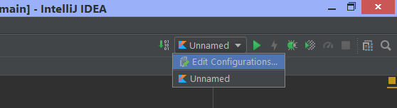
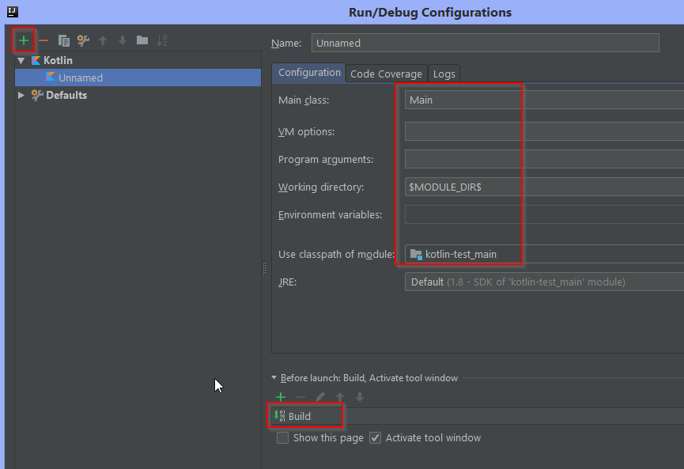

This project is a proof of concept of using VASCO 2 Factor Authentication Library in Mobile and Website

# Requirements
 * XCode >= 9.2 (Swift 4.0)
 * IntelliJ IDEA >= 2018.1 (Kotlin 1.2)

# Setup QRGenerator Backend
 1. Install Java JDK
 ```
 brew update
 brew cask install java8
 ```

 1. add JAVA_HOME to your environment file ~/.zprofile
 ```
 export JAVA_HOME="$(/usr/libexec/java_home -v 1.8)"
 export PATH=${PATH}:$JAVA_HOME/bin
 ```

 1. install gradle
 ```
 brew install gradle
 ```

 1. Open project with IntelliJ IDEA
 1. Create build configuration like image below <br>  <br><br> 
 1. Run project
 1. Go to url http://localhost:8080/ 
